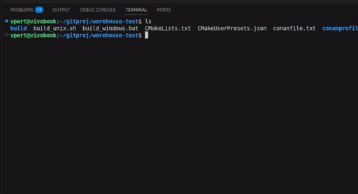

# Warehouse

Тестовое задание: Система управления складом



## Требования для сборки проекта

- CMake 3.23+
- Conan 2.15+
- Компилятор C++17 (MSVC, GCC, Clang)

## Быстрый старт

### Установка Conan

```bash
pipx install conan
conan profile detect
```
### Использование приложения

Требуется перейти в корневую директорию проекта
```bash
cd warehouse
```

Дальше надо сделать скрипты исполняемыми
```bash
chmod +x scripts/*.sh
```

Теперь можно использовать make для запуска программы
```bash
make build
make run
```
Весь функционал перечислен ниже
```bash
make help           # Показать справку
make build          # Собрать проект
make rebuild        # Пересборка
make clean          # Очистка build/
make status         # Статус сборки
```

## Требования к заданию

### Используемые инструменты

- RAD Studio С++ Builder Community Edition
- Postgresql (можно Sqlite)

### Консольная утилита должна позволять:

- Просматривать список номенклатур и их текущее количество на складе.
- Добавлять и изымать со склада единицы номенклатуры (с указанием и без указания количества) – приемка/отгрузка.
- Редактировать сам справочник номенклатур – параметры, цены.
- *Имитировать «прослеживаемость товаров».
- *Просматривать историю изменений.
- **При желании можно сделать деление на несколько складов.

### Учесть следующие параметры:

- Запросы должны быть написаны на чистом SQL.
- Храниться данные должны в базе данных.
- Если потребуются настройки, то они должны храниться в файле config.ini или config.json.
- Система должна регламентировать ввод данных, то есть не позволять изъять отсутствующие единицы номенклатур и при неверном вводе пользователя сообщать о причине отказа в выполнении команды.

### Параметры выполнения:
- Программа должна компилироваться стандартным компилятором RAD Studio С++ Builder Community Edition под Windows 10 или 7.
- Предоставить необходимо полную папку проекта в виде исходных кодов.
- Задание рассчитано на 2-5 часов в течение не более чем 2-5 календарных дней.
